# VRChat CYD Pager

A Wi-Fi-connected, logged-in, authenticated, standalone VRChat pager for the
common **ESP32-2432S028R Cheap Yellow Display**. The pager signs directly into
VRChat and maintains its own secure Pipeline WebSocket connection, so it receives
notifications independently without a PC-side OSC router, companion application,
or captive portal.

## Install

Open the [browser installer](https://mellishrat.github.io/VRChat-CYD-Pager/) in
desktop Chrome or Edge and connect the CYD over a data-capable USB cable. Put the
ESP32 into firmware-download mode before starting the installation:

1. Press and hold **BOOT**.
2. While still holding **BOOT**, press and release **RESET/EN**.
3. Continue holding **BOOT**, click **Connect & install**, and select the CYD's
   serial port.
4. Keep holding **BOOT** until the installer begins erasing or writing the new
   firmware, then release it.

Start with **Standard display**. If the screen appears pale, negative, or has
inverted colours, return to the browser installer and choose **Inverted-colour
display fix**. Different CYD production batches can require opposite LCD
inversion settings.

After installation, reset the CYD if it does not restart automatically. Use its
touchscreen to select your Wi-Fi network and enter its password, then enter your
VRChat credentials and complete TOTP or email verification if requested. Wi-Fi
credentials and the authenticated VRChat session are saved on the pager.

## Repository layout

| Path | Contents |
|---|---|
| `firmware/VRChat_CYD_Pager/` | Arduino source |
| `docs/` | GitHub Pages installer and help |
| `docs/firmware/` | Versioned merged binary and checksum |
| `scripts/build-firmware.ps1` | Reproducible Windows build/release script |
| `.github/workflows/` | Compile verification and Pages deployment |

## Features

- On-device Wi-Fi scan, password entry, and saved credentials.
- Direct VRChat login with TOTP and email OTP support.
- Saved authentication session and quiet Pipeline reconnection.
- Invites, friend events, boops, group events, and system alerts.
- Touchscreen notification detail views, RGB LED alerts, and audio cues.
- Configurable time zone and three-minute display timeout.

## Build from source

See [firmware/README.md](firmware/README.md). Firmware 0.5.2 is built with ESP32
Arduino core 3.3.11 and the pinned libraries documented there.

## Release checklist

1. Update the version in the sketch, manifest, file names, changelog, and page.
2. Run `powershell -ExecutionPolicy Bypass -File scripts/build-firmware.ps1`.
3. Verify the SHA-256 and browser-install the merged image on real hardware.
4. Tag `vX.Y.Z`; attach the `.bin`, `.sha256`, and source archive to the release.

Licensed under the [MIT License](LICENSE).

## Interface screenshots

These clean renders show the pager's 320×240 touchscreen interface. Example
account, network, and notification names are fictional.

| Boot | Wi-Fi selection |
|---|---|
| 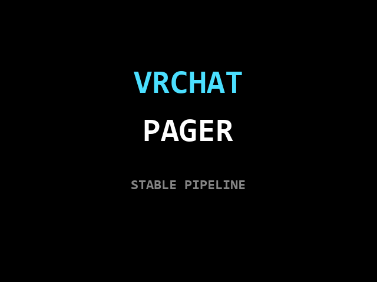 | 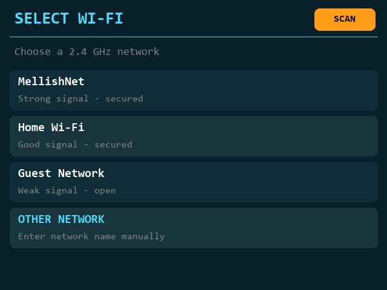 |

| VRChat login | Two-factor authentication |
|---|---|
| 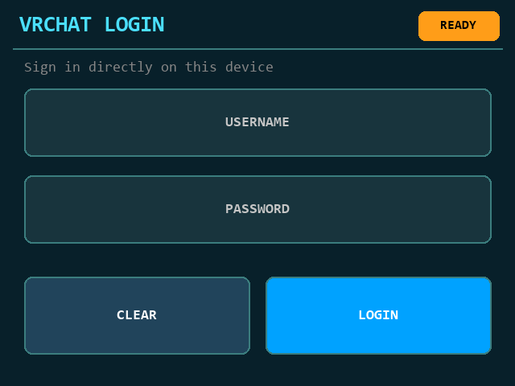 | 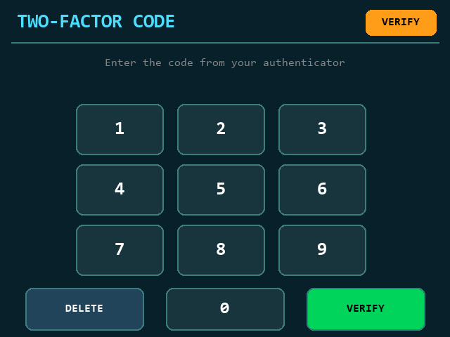 |

| Connected home screen | Notifications |
|---|---|
| 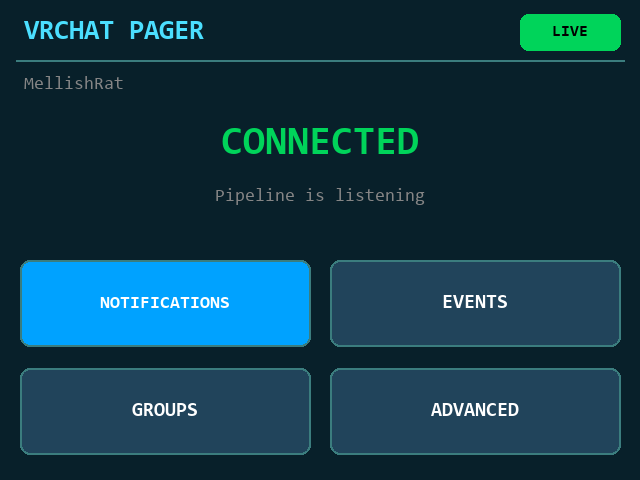 | 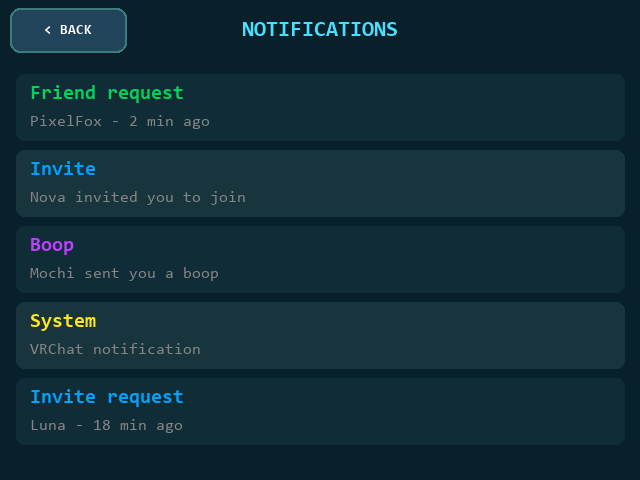 |

| Friend events | Group activity |
|---|---|
| 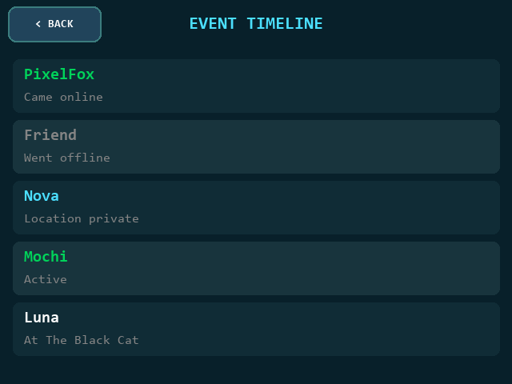 | 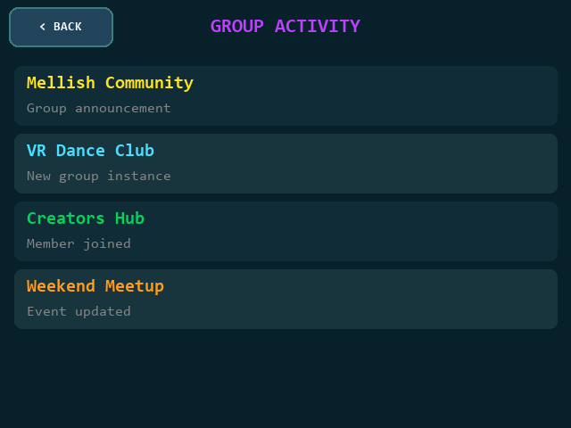 |

| Notification details | Advanced information |
|---|---|
| 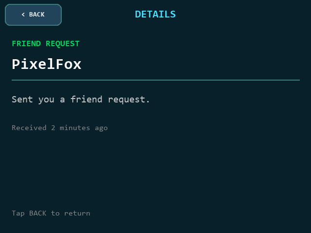 | 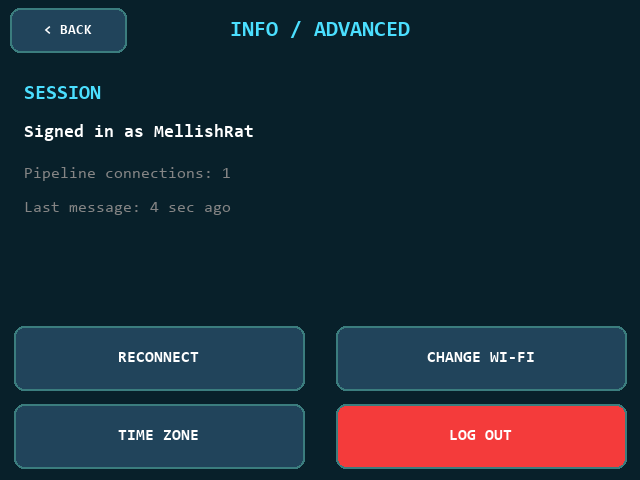 |

| Time-zone settings |
|---|
| 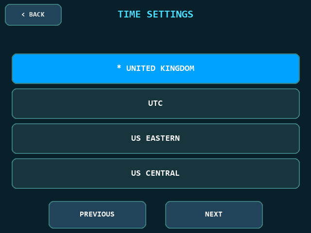 |
